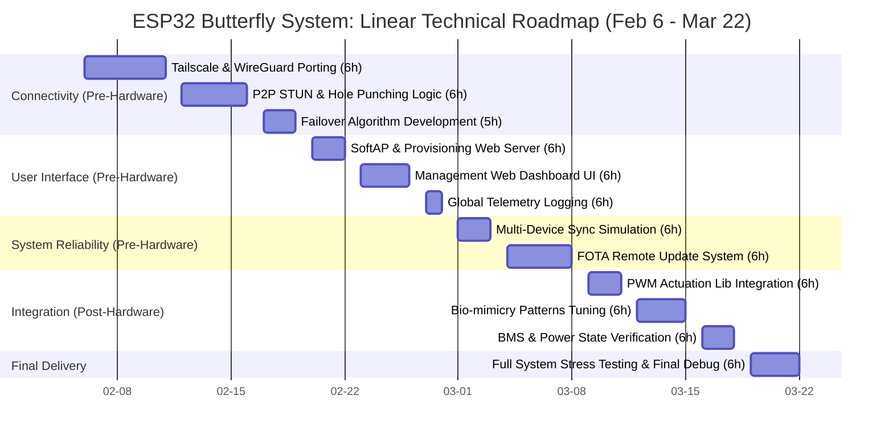

#### 1. Core Actuation & Power Logic

* **PWM Actuation Library**: Develop a dedicated PWM control class to handle different motor/vibration prototypes (matching Prototype 1, 2, and 3).
* **Bio-mimicry Flapping Patterns**: Script variable frequency and duty-cycle profiles to simulate organic butterfly movement.
* **Battery Management System (BMS) Firmware**:
* Implement ADC voltage-divider reading for real-time battery level monitoring.
* Create a power-save state machine (switching between Active, Idle, and Deep Sleep).
* Code a "Safe-Shutdown" logic to preserve battery health during long-term installation.

#### 2. Networking & Global Connectivity (The Cross-Border System)

* **Tailscale Integration (Route A)**:
* Port and compile a lightweight WireGuard/Tailscale client for the ESP32 environment.
* Implement an automated authentication flow using pre-authorized Auth Keys.
* Monitor DERP relay latency to ensure cross-border responsiveness.

* **P2P Pathfinding (Route B)**:
* Develop a STUN client to discover public IP/Port mappings in different network environments.
* Implement a UDP hole-punching handshake protocol for direct peer-to-peer connection.

* **Failover Logic**: Write the "Path-Selection" algorithm that automatically switches between Tailscale and P2P based on link health.

#### 3. Onboarding & Device Management

* **SoftAP Provisioning System**:
* Develop the Captive Portal for Wi-Fi credential input (No-app-required onboarding).
* Implement NVS (Non-volatile Storage) handlers to store and recall Wi-Fi and Tailscale credentials.

* **Management Web Interface**:
* Build an embedded Web Server to host a local dashboard for each butterfly.
* Implement a WebSocket API for real-time "Butterfly Management" (triggering, status pings).

* **Global Telemetry Logging**: Create a remote debug bridge to capture system logs from overseas deployments for troubleshooting.

#### 4. System Integration & Scaling

* **Multi-Device Synchronization**: Script the logic to allow one "Master" butterfly/server to trigger "x amount" of butterflies simultaneously.
* **Firmware-over-the-Air (FOTA)**: Implement a remote update system to patch code across all butterflies once they are deployed in the cultural context.
* **Stress Testing**: Benchmark the ESP32's memory and CPU usage during sustained global network activity.
