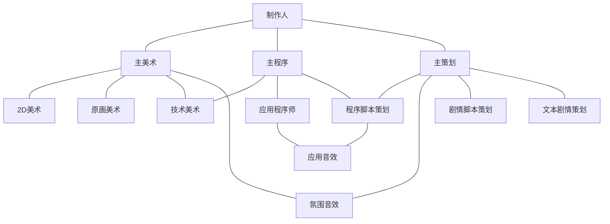

# 项目名称
`单车`

# 简介
- 社畜主人公在选择淘汰陪伴十年的单车的最后一晚，游历整个城市，将回忆和热情一步步找回的故事

<!-- more-->

# 概要
- ## 设计背景
1. 十年的高速发展使得中国的面貌有了极大改观，它带来了社会生活质量的进步，但也带走了一些灵魂中的东西。
2. 本项目通过将单车作为这种意识的象征，让其引领主人公在最后一次环行中逐步唤醒心中沉睡的`逐步丢失的灵魂`，得到身心上的回归和犀利。

- ## 设计说明
	- ### 美术设计
	`横版正交视角`，参考十三机兵防卫圈。
	美术设计是此类氛围向游戏的灵魂，通过画面将玩家逐步带入主人公的故事，为玩家沉浸于故事提供了良好的基底。
	- ### 系统设计
	```mermaid
	graph TD;
	A[人物系统] 
	B[背景系统] 
	C[其他系统]
	A-->D[人物动画控制]
	D-->骑行动画
	D-->移动动画
	B-->E[时间控制]
	E-->清晨
	E-->白天
	E-->午后
	E-->傍晚
	E-->夜晚
	B-->场景控制
	C-->对话系统
	C-->时间轴系统
	A-->人物时间段切换
	```
	- ### 剧情脚本设计
	本作剧情设定为`一小时左右的小短片`，故大致为线性剧情，少有分支，但不影响结局。
	- ***脚本设计说明***
		1. 先使用**流程图**，将*关键的*`时间/空间节点`进行串联，并标注每个节点的序号
		2. 再对每个`节点`展开，撰写具体的对话和动作内容
		
		例`(十三机兵防卫圈脚本设定集)`(加载时间略长，一般需要五分钟左右)：
		

# 目标人员
- ## 程序
	1. 至少掌握一项面向对象语言
	2. 代码结构明确，文档清晰
	3. 掌握git以及plasticSCM的使用方法
	4. 了解Unity，能够熟练使用Unity则更佳
	5. 拥有较好的沟通能力
	6. 拥有较好的学习能力
	7. 及时反馈
- ## 美术
	- ### 原画美术
		1. 能够根据剧情以及人物设定，设计出符合氛围的原画作品
		2. 掌握git的使用方法
		3. 拥有较好的沟通能力
		4. 拥有较好的学习能力
		5. 及时反馈
	- ### 2D美术
		1. 能够根据原画设定，绘制出对应的人物或场景物件
		2. 拥有良好的团队协调能力，保证团队画风一致
		3. 掌握git的使用方法
		4. 拥有较好的沟通能力
		5. 拥有较好的学习能力
		6. 及时反馈
	- ### 技术美术
		1. 能够熟练使用Unity完成Shader、后处理、光线效果、粒子效果等
		2. 代码结构明确，文档清晰
		3. 掌握git以及plasticSCM的使用方法
		4. 拥有较好的沟通能力
		5. 拥有较好的学习能力
		6. 及时反馈
- ## 策划
	- ### 文本剧情策划
		1. 能将剧情以类小说形式撰写
		2. 掌握markdown语言，会使用obsidian进行团队合作
		4. 拥有较好的沟通能力
		5. 拥有较好的学习能力
		6. 及时反馈
	- ### 剧情脚本策划
		1. 能够将文本剧情抽象成剧情脚本，并且清晰明确
		2. 掌握markdown语言，会使用obsidian进行团队合作
		4. 拥有较好的沟通能力
		5. 拥有较好的学习能力
		6. 及时反馈
	- ### 程序脚本策划(架构师)
		1. 至少掌握一门面向对象语言
		2. 能够使用多种设计模式进行程序脚本的设计
		3. 了解Unity的工作模式
		4. 掌握markdown语言，会使用obsidian进行团队合作
		5. 掌握Visio的使用方法
		6. 拥有较好的沟通能力
		5. 拥有较好的学习能力
		6. 及时反馈
- ## 音效
	- ### 氛围音效(BGM)
		1. 拥有从剧情中抽象出氛围并作曲的能力
		3. 掌握git的使用方式
		4. 拥有较好的沟通能力
		5. 拥有较好的学习能力
		6. 及时反馈
	- ### 应用音效
		1. 拥有对各种细微声效的捕捉和采集能力
		2. 掌握git的使用方式
		4. 拥有较好的沟通能力
		5. 拥有较好的学习能力
		6. 及时反馈

# 开发环境
1. Unity+PlasticSCM *开发*
2. Git+GitHub *团队资源共享*
3. QQ+飞书+可能会出现的团队合作集成软件 *交流*
4. Obsidian+Zerotier *设计信息实时共享*
5. Visio *流程架构设计*

# 组织架构


# 附录
[markdown官方教程](https://markdown.com.cn)
[廖雪峰git教程](https://www.liaoxuefeng.com/wiki/896043488029600)
[Runoob C#教程](https://www.runoob.com/csharp/csharp-tutorial.html)
[Unity中文课堂](https://learn.u3d.cn)

- 时间表
	```mermaid
	gantt
	title 简化时间图
	dateFormat YYYY-MM-DD
	section 制作
	企划书制作 :2022-09-30,3d
	新人招收 :2022-10-02,10d
	环境搭建及前期工作 :2022-10-01,14d
	剧情撰写 :2022-10-05,30d
	程序策划及实验 :a,2022-11-01,14d
	制作 :b,after a,60d
	测试 :after b,10d
	```