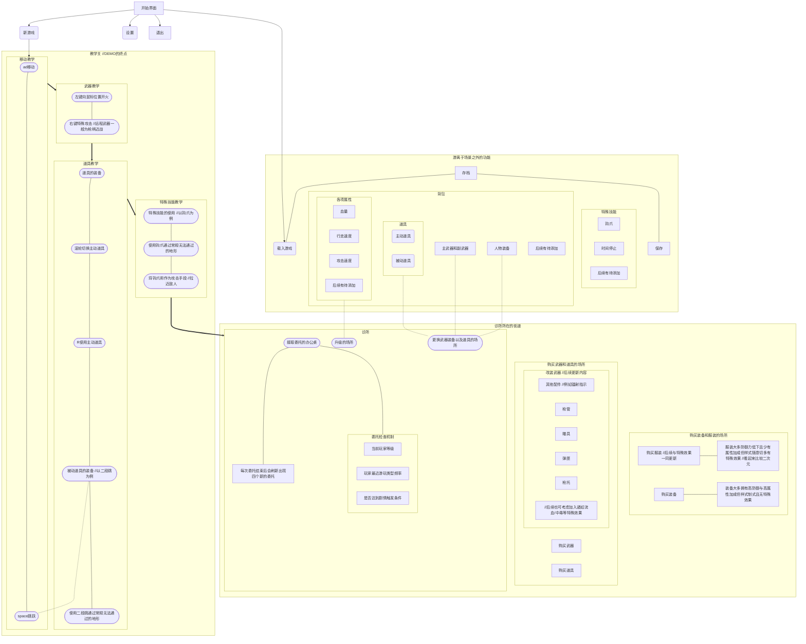

# 引言

此项目设计是基于项目组成员**程禹**的提议，外加我个人的思路衍生而形成。此篇文章将会介绍游戏涉及到的功能框架。

<!--more-->

# 框架

# 流程外的内容
1. 游戏整体的推进方式依照剧情而定，例如：
	1. `等级推进`在玩家到达某指定等级后便会强制进入剧情
	2. `时间推进`游戏内时间是有一定流逝速度的，无论玩家在做什么时间都会经过。而到达了某一特定时间，玩家便会强制进入剧情
	3. `事件推进`这种方法比较传统，需要和其他的进行组合。例如完成了某个npc的任务后，走到另外某处地方便会发生事件而进入剧情；达到了一定等级，当经过某处地方便会发生事件而进入剧情……
	
	依照剧情的进行方式，对框架进行更改而产生相应效果。

2. 框架仍然较为粗略，需要进行更加细致的描述，例如：
	1. 补全目前能想到的所有`特殊技能`
	2. 补全目前能想到的所有`武器右键效果`
	3. 补全目前能想到的所有`特殊效果`
	4. `近战类`武器在此框架中未被描述，需要斟酌后再进行制作

3. 因为内容的关系，网页上浏览字体较小，请搭配放大使用。

4. 由于时间限制，此次对于框架的描述并未搭配相关图例提示，若有未解之处请及时反馈。