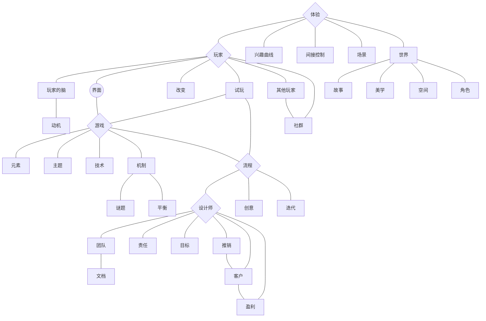

```mermaid
flowchart TB
A{体验}---B{玩家}
A---兴趣曲线
A---间接控制
A---场景
A---a[世界]
a---故事
a---美学
a---空间
a---角色
B---玩家的脑---动机
B---d((界面))---C{游戏}
B---改变
B---试玩---C
试玩---D
B---其他玩家---社群---B
C---元素
C---主题
C---技术
C---机制---谜题
机制---平衡
C---D{流程}---E{设计师}
D---创意
D---迭代
E---团队---文档
E---责任
E---目标
E---推销---客户---盈利
E---客户
E---盈利

click 团队 "https://iiishop.github.io/2022/10/06/游戏设计中的团队合作/" _blank
click 文档 "https://iiishop.github.io/2022/10/06/游戏设计中的团队合作/#关于游戏设计文档" _blank
```

# 可以通过`点击`进入相关推文页面

# 游戏设计是一项涉及范围非常广的事务，后面会不定期对每个涉及到的环节单独阐述。