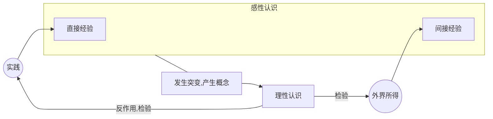

# 摘记
*`实践高于认识`*

*`只有社会实践才是人们对于外界认识的真理性的标准`*

***`首先看到了事物的现象，事物的各个片面，事物的外部联系-》认识的感性阶段`***

*`社会实践的继续，使引起感觉到东西反复了多次，生起了认识过程中的突变，产生了感念。概念已经抓住了事物的本质，事物的全体，事物的内部联系。`*
***`使用判断和推理的方法（认识的作用）作用在概念上而产生出了结论-》理性认识的阶段`***

*`感性认识到论理认识的推移`*

*`感觉到了的东西，我们不能立刻理解他；只有理解了的东西才更深刻的感觉他。`*

*`但人不能事事直接经验，事实上多数的知识都是间接经验的东西。`*

*`一个人的知识，不外直接经验的和间接经验的两部分。无论各种知识都是不能离开直接经验的。`*
*`经验是感性认识的一种`*

*`理性认识依赖于感性认识，感性认识有待于发展到理性认识，这就是辩证唯物论的认识论。`*

*`认识从实践始，经过实践得到了理论的认识，还需再回到实践去。`*

<!--more-->

# 引言
我常被某些感觉所吸引，非常怀念或又非常向往。常沉醉于其中，认为这就是我的追寻。但当我起身妄图寻觅他的源头，他便仿佛被掺混了杂质，逐渐模糊而无迹可寻，只有脑中残存的余韵表示了他的存在，并鼓舞我直到下一次偶遇。

我自认为是一个理性的人，因而脑中的思考从未有过停滞。我希冀于他的本源、他的存在、他的流向，认为这就是带来世界大一统的关键一处。有些时候，一处场景、一幅画、一首歌、一个字，甚至于脑中闪过的一道电流，都会将我导向某种感觉。将他们抓住，编织成一串思想的网，看看他们的最终走向。

稍微了解了一点深度学习的知识后，我认为人的感觉全来源于事物特征的集合。这显然是模糊的，他的最终不将会是完全绝对的，甚至于连常识中的一加一都有可能不等于二。根据其他常识的判断，这显然是错误的，不过这一过程也指明了一部分的真理。

烦闷而在网上踱步，却偶遇一篇好文。其以自身经历为引，串以微光般的精神，在我蒙灰的前路中猛然地闪烁了一忽。这条光路，终将我引向了《实践论》这篇文章。

# 实践论
粗览全篇，已然被作者无边的理论功底和认知深度所惊艳。全篇的理论框架大抵可以以此表现 (排版可能歪了)：

首先，一切的来源都是实践，实践高于一切，实践产生了经验（感觉）从而才有了认识。外界所得指的是其他人的直接经验，例如我们读书，获得的是间接经验，但这对于书的作者来说是直接经验；现代人循古，是间接经验，但对于古人来说是直接经验。

我们通过实践，看到了事物的现象、事物的各个片面、事物的外部联系，从而获得了感觉。感觉在脑中盘旋，在经过数次反复后，由量变引起质变，发生了突变，产生了概念，因此有了认识。

接着，我们使用认识得出一些想法而反作用于实践，若认识是正确的，实践也会再次按照脑中预想的成功；若其是错误的，实践也会反映出来，我们也获得了其他的经验，从而继续发展认识。

上述即为实践论的基本流程，在此仅粗略陈述，下面是我个人的部分感悟。

# 想法
1. ## 认识是不能被表述的，而感觉可以。
	是的，我们能得到的所有信息都只是感觉，而认识，作为最高一层的思维，只会盘旋于每个人的脑子而无法通过表述让其他人产生相同的认识。
	
	或许有些人会认为，教科书上的结论性指示，例如科学公式，我们在看到之后便能将其应用于实践（计算），这是否即为我们通过书的表述而获得了认识？
	
	我认为这并不是获得了认识，或者说我们通过学习公式并不能获得等同于公式发明者或者公式编写人在撰述时的完全的认识。我们确实获得了认识，但这些认识是通过理解公式这一实践和我们其他已有的认识结合作用下产生的认识，对于这部分，会在下一条想法中讲述。
	
	感觉是可以表述的，我们可以通过各种表现方式来向人描述我们的感觉，这些描述是直观的，例如我们看到了一篇文章，获知了文章中的某些观点，我们可以通过使用摘记的方式将其告知他人，而他人看到的摘记和我们看到的是完全一致的；又比如我们看到一幅画或者听到一首歌，那么完全可以将其原原本本地表现在他人的面前，他人获知的就是与我们获知的相同的感觉。
	
	或许有些时候我们自认为在讲述着认识，
1. ## 认识会相互结合而检验、发展新的认识
2. ## 感觉最终导向于认识
3. ## 认识无时无刻不在产生
4. ## 认识的实效性